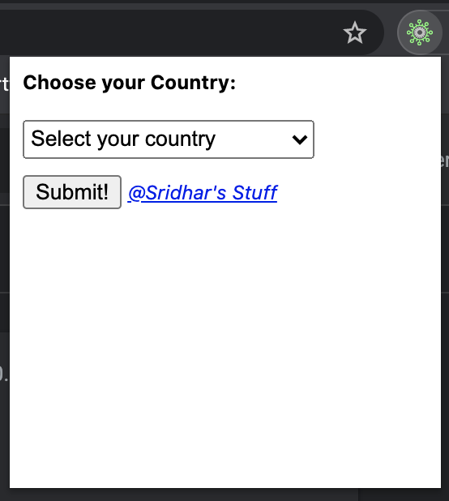
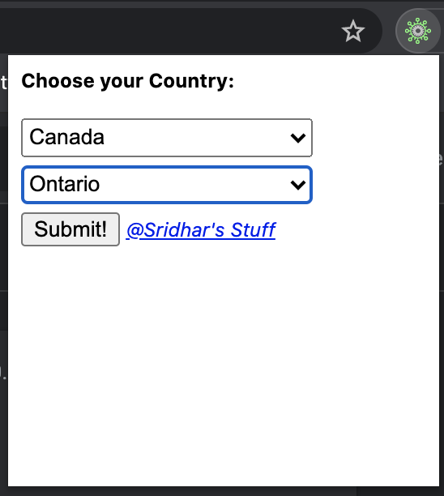
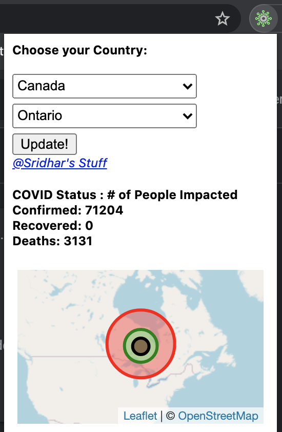

  

 
<h2>Covid-Ex-Tension :</h2>
<b>An Extension that plots and displays the Covid-19 information in a pocket-sized view.</b>

TABLE OF CONTENTS

 <pre> INTRODUCTION </pre>
<pre> SPECIFICATIONS </pre>
<pre> SOFTWARES REQUIRED </pre>
<pre> SOURCE CODE </pre>
<pre> INSTALLATION NOTES </pre>
<pre> ABOUT THE APPLICATION </pre>

INTRODUCTION\
 An Extension that plots and displays the Covid-19 information in a pocket-sized view in the Browser [Chrome].
  
<b>Check out this video to see the demo.</b>

<pre><i>If the above video doesn't seem to work, you can find the same clip of Demo at (~/readme_figs/DemoVideos/CovidExtensionDemo.mp4) location.</i></pre>

SPECIFICATIONS

 <pre>A Chrome browser extension which accepts the Country and Province (if available), then creates the Map to be displayed with Covid information in the region:</pre>
<ul>
<li> Display a dropdown "Choose your Country:" in the Top to allow user to select a Country.</li>
<li> Display a dropdown "Choose your Province:" in the Top to allow user to select a Province if the provinces list is returned by the API.</li>
<li> Display a button "Submit" to allow user to create and view the Covid information plotted onto a Map.</li>
<li> Display a button "Update" to allow user to update the Covid information plotted onto a Map.</li>
<li> Update the zoom level on the Map based on the type of selection made i.e. Country to be zoomed less and Province to be zoomed closer.</li>
<li> Retain the previous session information and display the information each time user checks the extension.</li>
<li> Show loading icons while the Provinces list is being populated and the Map is being rendered.</li>
</ul>
<pre>When the User presses the "Cvid-Ex-Tension" extension icon:</pre>
<ul>
<li> Fetch the List of countries using the API and populate the List of Countries in the "Choose your Country:" Dropdown.</li>
</ul>
<pre>When the User selects a country from the "Choose your Country:" dropdown:</pre>
<ul>
<li> Fetch the Provinces information (if any) and Covid information from the API.</li>
<li> If Provinces information is available then Populate the Provinces list and display the dropdown, Submit/Update button to the user.</li>
</ul>
<pre>When the User presses the "Submit" button:</pre>
<ul>
<li> Show the Map with the Covid information to the User.</li>
<li> Show the 'Update" button and hide the "Submit" button.</li>
</ul>

SOFTWARES REQUIRED\
 The software that are needed for the application to be edited or executed

<ul>
<li> OPERATING SYSTEM UTILIZED: MAC OS- Catalina </li>
<li> ‘technology’ --> javascript</li>
<li> ‘map’ --> leaflet</li>
<li> ‘API resource’ --> <a href="https://documenter.getpostman.com/view/10808728/SzS8rjbc#9739c95f-ef1d-489b-97a9-0a6dfe2f74d8">COVID API used</a></li>
</ul>

SOURCE CODE\
 The Source code for the application is in the 'Covid-Ex-Tension' folder

<ul>
<li> 'assets' --> Has all the Images and GIFs needed for the extension.</li>
<li> 'backgroundScripts' --> Has the script files needed by the background process of the extension.</li>
<li> 'contentScripts' --> Has the script files needed by the the extension to handle the content of the pages in the browser Tab.</li>
<li> 'customStyles' --> Has the CSS files for handling the styles of the UI.</li>
<li> 'libScripts' --> HAs the script files needed by the libraries used in the extension.</li>
<li> 'pages' --> Has the HTML files.</li>
<li> 'scripts' --> Has the script files needed for handling the Extension UI.</li>
</ul>

INSTALLATION NOTES\
 All the execution of this application will be done upon. <b>NO EXECUTION COMMANDS REQUIRED!</b>

<ol type="A">
<li> Covid-Ex-Tension Application’ </li>
	<ul>
		<li> Enable Developer mode by navigating into 'chrome://extensions'.<b>python GifEngineer.py</b></li>
		<li> Click on the <b>'Load unpacked'</b> button.</li>
		<li> Navigate into your /Covid-Ex-Tension/ directory and click 'Select' button </li>
	</ul>
	</ol>

ABOUT THE APPLICATION\
 This application opens up a popup window after you have loaded the extension following the steps specified in the ‘INSTALLATION NOTES’ section.

The application loads and opens up a popup window with only the "Choose your Country" dropdown text displayed. Figure 1 shows the screen when the extension is clicked.

    Figure 1: Start-up Screen

    Figure 2: Display of the dropdown while the provinces are being loaded.

    Figure 3: Display of the dropdown after a province is selected.

    Figure 4: Display of the dropdown after 'Submit' is clicked.
